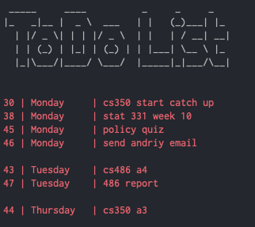

# TODO

## Setup
1. Create `todo` database, and run this command to create the table:

```
$ mysql todo < create_tables.sql
```

2. Add cronjob to update task dates after date ticks over

```
0 0 * * * /usr/local/bin/mysql todo < [mypathtoproject]todo/update_date.sql
```

3. Add permissions:

```
$ chmod u+x update.sh; bash update.sh
```

## How to Use
Just run `todo --help`, it's super easy to work with


